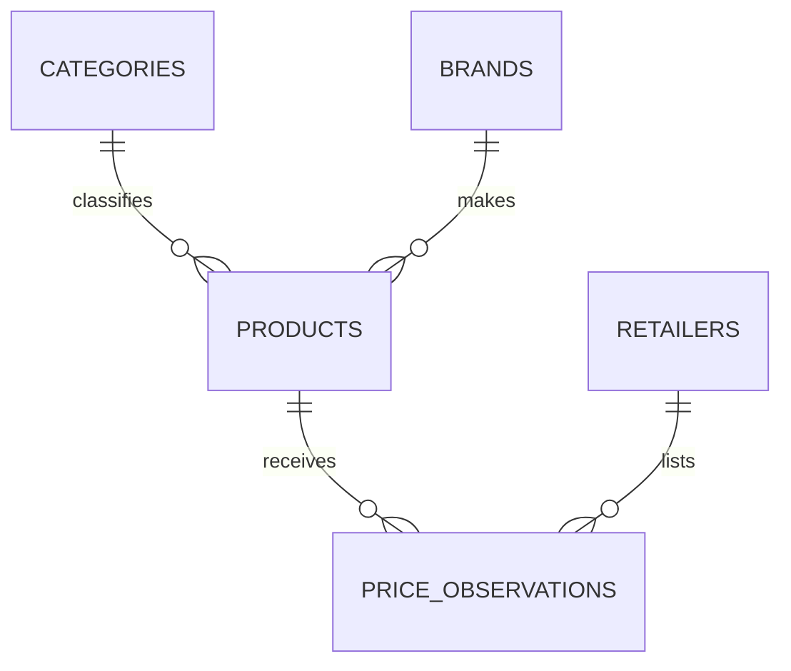

# Project 2: Market Research and Price Comparison

This beginner-friendly SQL project compares the listed prices of the same
product across retailers. It teaches database design, importing a CSV dataset,
CRUD operations, joins, aggregate reporting, and the practical differences
between SQLite and MySQL.

## Teaching In 90 Minutes

Yes, this project can be completed in a 1.5-hour class when the live lesson
uses SQLite. Teach table design, basic `SELECT`, CRUD, and one joined price
comparison query. Present MySQL syntax differences and the advanced report as
reference or homework rather than configuring a MySQL server during class.

Use [`SQL_BASICS_README.md`](SQL_BASICS_README.md) as the student lesson sheet.
It includes a timed class plan, beginner SQL notes, copy-ready commands,
practice queries, and exit exercises.

## Dataset

`data/product_prices.csv` contains 30 sample price observations for 10 products
across Amazon India, Flipkart, Croma, and Reliance Digital. Prices are in INR
and each row is a listing captured on `2026-05-20`.

This is an educational, curated dataset made for the project. It is not live
shopping data and should not be used to make purchasing decisions.

## SQLite And MySQL Basics

SQLite is a small database stored in one local file. It ships with Python and
is ideal for learning, prototypes, and small local applications. This project
runs on SQLite immediately without installing packages or a server.

MySQL is a database server used by multiple applications and users. It needs a
running MySQL installation, user credentials, and database permissions. The
project includes MySQL-compatible schema, import, and CRUD scripts to repeat
the exercise in a server database.

| Task | SQLite | MySQL |
| --- | --- | --- |
| Start a database | Open a `.db` file | Connect to a server/database |
| Auto-number column | `INTEGER PRIMARY KEY AUTOINCREMENT` | `INT AUTO_INCREMENT PRIMARY KEY` |
| Boolean storage | Usually `0` / `1` | `BOOLEAN` (`TINYINT` internally) |
| Ignore duplicate insert | `INSERT OR IGNORE` | `INSERT IGNORE` |
| Upsert update | `ON CONFLICT ... DO UPDATE` | `ON DUPLICATE KEY UPDATE` |

## Database Design

The data is normalized: product information is stored once, and a price
observation records one retailer's offer at a point in time.



`price_observations` has a unique combination of product, retailer, and capture
date. Importing the same CSV again refreshes matching observations instead of
duplicating them.

## Project Files

| Path | Purpose |
| --- | --- |
| `data/product_prices.csv` | Importable dataset |
| `outputs/project-2/market_research_dataset.xlsx` | Formatted dataset and summary workbook |
| `SQL_BASICS_README.md` | Student handout and 90-minute classroom flow |
| `src/market_research_db.py` | Working SQLite command-line application |
| `sql/schema_sqlite.sql` | SQLite table design |
| `sql/crud_queries_sqlite.sql` | SQLite CRUD and comparison queries |
| `sql/schema_mysql.sql` | MySQL table design |
| `sql/import_mysql.sql` | MySQL CSV import using a staging table |
| `sql/crud_queries_mysql.sql` | MySQL CRUD and comparison queries |
| `tests/test_market_research_db.py` | Automated verification |

## Run With SQLite

From this folder, use Python 3:

```bash
python3 src/market_research_db.py setup --reset
python3 src/market_research_db.py stats
python3 src/market_research_db.py report
python3 src/market_research_db.py report --category Audio
python3 src/market_research_db.py crud-demo
python3 -m unittest discover -s tests -v
```

Open `outputs/project-2/market_research_dataset.xlsx` for a filterable version
of the dataset with formula-driven cheapest-price analysis and a savings chart.

After setup, the counts should be:

```text
products: 10
retailers: 4
price_observations: 30
```

You can also practice in the SQLite shell after the application has created
the database:

```bash
sqlite3 data/market_research.db
```

```sql
.headers on
.mode column
SELECT * FROM products;
.read sql/crud_queries_sqlite.sql
```

## CRUD Operations

CRUD means the four basic database actions:

| Operation | SQL Command | Example In This Project |
| --- | --- | --- |
| Create | `INSERT` | Add a retailer listing for the Logitech mouse |
| Read | `SELECT` | Compare offers ordered by lowest price |
| Update | `UPDATE` | Change the promotional listed price |
| Delete | `DELETE` | Remove the demo listing |

Run `python3 src/market_research_db.py crud-demo` to execute all four actions
and display their results. It deletes the demonstration observation at the end,
so the imported comparison dataset remains unchanged.

## Run The SQL In MySQL

Install and start MySQL first, then connect with a user able to create a
database. The local machine used to create this project did not have a MySQL
client installed, so the SQLite implementation is the verified runnable path.

```bash
mysql -u root -p < sql/schema_mysql.sql
```

Edit the CSV absolute path inside `sql/import_mysql.sql`, then use local infile
support to load the data and run the exercises:

```bash
mysql --local-infile=1 -u root -p < sql/import_mysql.sql
mysql -u root -p < sql/crud_queries_mysql.sql
```

## Suggested Analysis Questions

1. Which product has the largest rupee saving between available retailers?
2. Which retailer provides the lowest price most often?
3. How should the schema change if prices are captured every day?
4. What happens to comparison results when an item is out of stock?
